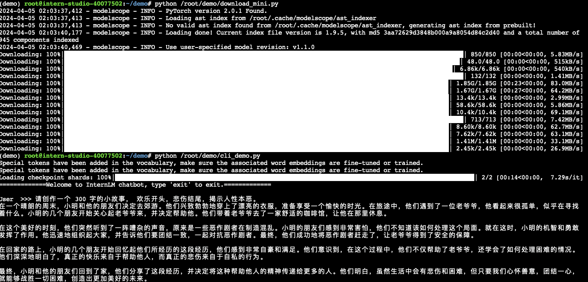
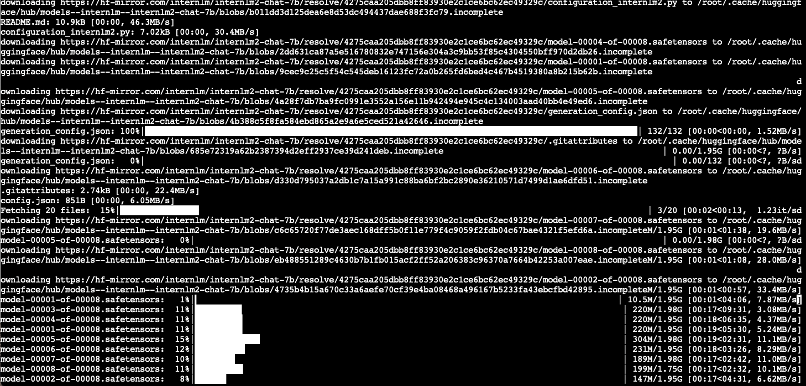

### HW1
### LLM Application Working Flow:


### LLM Model
#### Pretrained LLM Model
1. Model Selection 
2. Pre-train data preprocessing 
  2.1 datadistributation 
  2.2 data processing: (Format data)->(Clean data)->(Dedup data)->(Safe data).
3. Pre-train tokenization 

#### Training LLM Model
1. distributed training
2. experiment tracking 

#### Fine-tunning LLM Model
1. SFT(supervised fine-tunning): fine-tunning for downstream application
   
    a. define high level objective

   b. select model and tokenizer
     1. in general left padding is recommended, however LLaMA2 used right padding.

   c. select dataset, and preprocess data to follow the default template.
   
     For instance LLaMA chat template (prompt_template = PROMPT_TEMPLATE.llama2_chat):
    ```
    <bos_token>[INST] B_SYS SystemPrompt E_SYS Prompt [/INST] Answer <eos_token><bos_token>[INST] Prompt [/INST] Answer <eos_token> \
    <bos_token>[INST] Prompt [/INST] ....
    ```
   xtuner setup the dataset configuration:
    ```
    prompt_template = PROMPT_TEMPLATE.llama2_chat
    dataset_map_fn=alpaca_map_fn,
    template_map_fn=dict(
        type=template_map_fn_factory, template=prompt_template)
    ```
   contains two steps:


    1. convert dataset formate to xtuner formate, for example:  
    ```
    def oasst1_map_fn(example):
        r"""Example before preprocessing:
            example['text'] = '### Human: Can you explain xxx'
                              '### Assistant: Sure! xxx'
                              '### Human: I didn't understand how xxx'
                              '### Assistant: It has to do with a process xxx.'
    
        Example after preprocessing:
            example['conversation'] = [
                {
                    'input': 'Can you explain xxx',
                    'output': 'Sure! xxx'
                },
                {
                    'input': 'I didn't understand how xxx',
                    'output': 'It has to do with a process xxx.'
                }
            ]
        """
        data = []
        for sentence in example['text'].strip().split('###'):
            sentence = sentence.strip()
            if sentence[:6] == 'Human:':
                data.append(sentence[6:].strip())
            elif sentence[:10] == 'Assistant:':
                data.append(sentence[10:].strip())
        if len(data) % 2:
            # The last round of conversation solely consists of input
            # without any output.
            # Discard the input part of the last round, as this part is ignored in
            # the loss calculation.
            data.pop()
        conversation = []
        for i in range(0, len(data), 2):
            single_turn_conversation = {'input': data[i], 'output': data[i + 1]}
            conversation.append(single_turn_conversation)
        return {'conversation': conversation}
    
    ```
   2. add system prompt, and convert to template format
    
    ```
    def template_map_fn(example, template):
        conversation = example.get('conversation', [])
        for i, single_turn_conversation in enumerate(conversation):
            input_text = ''
            input = single_turn_conversation.get('input', '')
            if input != '' and input is not None:
                input = template.INSTRUCTION.format(input=input, round=i + 1)
                input_text += input
                instruction_postfix = ''
            else:
                instruction_postfix = template.INSTRUCTION.split('{input}')[-1]
            system = single_turn_conversation.get('system', '')
            if system != '' and system is not None:
                system = template.SYSTEM.format(system=system)
                input_text = system + input_text
            single_turn_conversation['input'] = input_text + instruction_postfix
        return {'conversation': conversation}
    
    
    def template_map_fn_factory(template):
        return partial(template_map_fn, template=template)
    ```
   d. evaluation matrix 

   e. select traing speedup
      1. Adapter 
      2. LoRA or QLoRA
      training LoRA
      ```
      from peft import LoraConfig, TaskType
      lora_config = LoraConfig(
          r=16,
          target_modules=["q_proj", "v_proj"],
          task_type=TaskType.CAUSAL_LM,
          lora_alpha=32,
          lora_dropout=0.05
      )
      model.add_adapter(peft_config)
      ```

      3. Quantation: bitsandbytes enables accessible large language models via k-bit quantization for PyTorch.
       to load and quantize a model to 4-bits and use the bfloat16 data type for compute:

       ```
        from transformers import AutoModelForCausalLM, BitsAndBytesConfig
        quantization_config = BitsAndBytesConfig(load_in_4bit=True, bnb_4bit_compute_dtype=torch.bfloat16)
        model_4bit = AutoModelForCausalLM.from_pretrained(
            "bigscience/bloom-1b7",
            device_map=device_map,
            quantization_config=quantization_config,
        )
       ```

        quantation of optimizer
      ```
      from bitsandbytes.optim import PagedAdamW32bit
      ```
      
      5. Framework: directly optimize memory and optimization--deepspeed: model scale, speed, scalibility
      ```
      from transformers.integrations import HfDeepSpeedConfig
      from transformers import AutoModel
      import deepspeed
      
      ds_config = {...}  # deepspeed config object or path to the file
      # must run before instantiating the model to detect zero 3
      dschf = HfDeepSpeedConfig(ds_config)  # keep this object alive
      model = AutoModel.from_pretrained("openai-community/gpt2")
      engine = deepspeed.initialize(model=model, config_params=ds_config, ...)
      deepspeed --num_gpus=2 your_program.py <normal cl args> --do_eval --deepspeed ds_config.json
      ```
      
   f. inference speed up 
      1. Quantation to reduce the number of bits: GPU-AWQ/GPTQ, CPU-GGUF/GGML
      2. Pageattention
      3. Flashattention
      4. Framework:deepspeed(only zero-3)
    
    g. deployment 

3. RLHF(reinforce learning with human feedback)

#### Evaluation 
1. Evaluation Benchmark Dataset 
    1. Performance on Downstream Tasks:(1) 全面测试(),(2) 语言和知识,(3) 推理和数学,(4) 多种编程语言编程,(5) 长文本建模,(6) 工具利用。
    2. Performance on Alignment: 评估模型的对齐能力对于判断LLMs是否真正满足人类需求至关重要。
    
2. Evalution Matrix

#### Ablation Study

- [x] 1.download hugging face pretrained model
- [x] 2.download dataset
- [x] 3.run the training
- [x] 4.why the evaluation model is so wired? can not evaluate the performance. Unless use the evaluation dataset. 
- [ ] 5.RAG or agent: how does RAG or agent work? Done. Compass evaluation. 
- [ ] 7.Modify to flexiable framework for training and deployment. This could be much simpler. The frame work wrapped too much, reduce the flexibility.
- [x] 8.How does the traininer know to only tune the weight for LoRA? make only the LoRA weight trainable


#### LlamA2
1.training use bfloat16
2.add token We can’t have the same logic, make sure to add a padding token using tokenizer.add_special_tokens({"pad_token":"<pad>"}) and resize the token embedding accordingly. You should also set the model.config.pad_token_id. The embed_tokens layer of the model is initialized with self.embed_tokens = nn.Embedding(config.vocab_size, config.hidden_size, self.config.padding_idx), which makes sure that encoding the padding token will output zeros, so passing it when initializing is recommended.
what does this mean? pad_token_id=tokenizer.eos_token_id

3.sentense peice tokenizer

4.attn_implementation="flash_attention_2", don’t pass torch_dtype to the from_pretrained class method and use Automatic Mixed-Precision training. When using Trainer, it is simply specifying either fp16 or bf16 to True. Otherwise, make sure you are using torch.autocast. This is required because the Flash Attention only support fp16 and bf16 data type.

5.template

#### HW2




