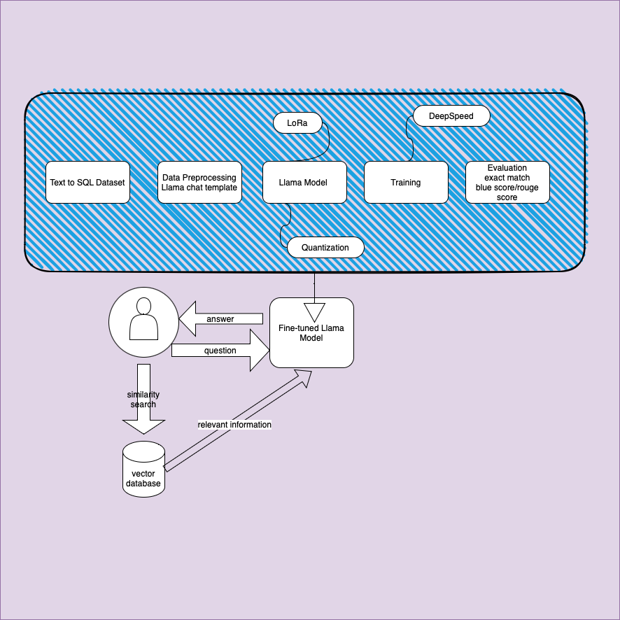
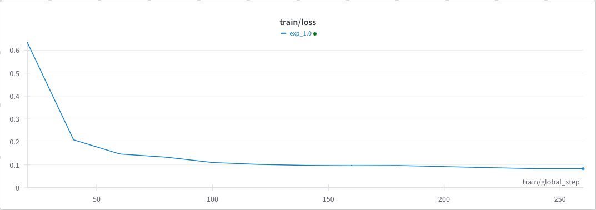
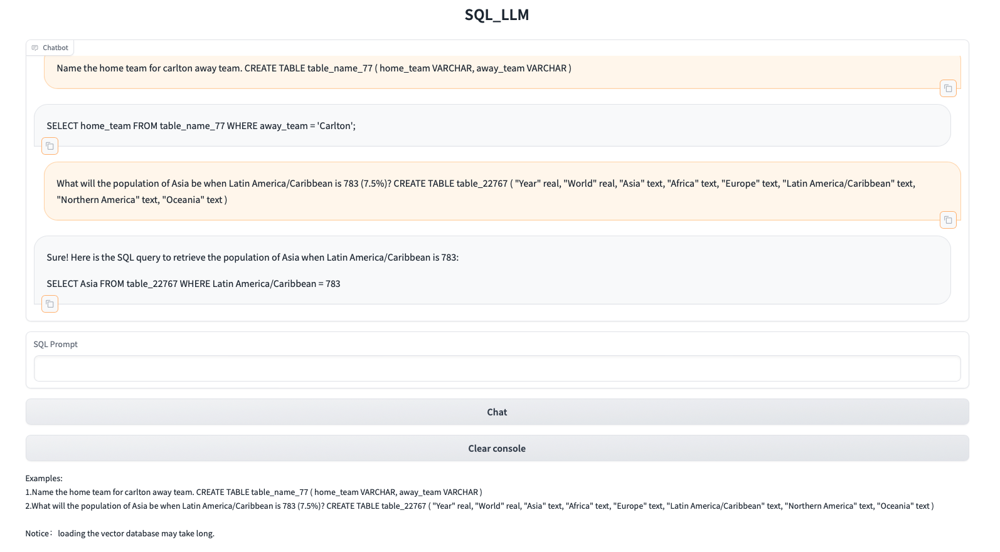

### Project Overview
This project contains two parts: 
1. Instruction fine-tuning Llama model on Text-to-SQL dataset.
2. Constructed a vector database to enhance Llama’s performance utilizing the Retrieval-Augmented Generation (RAG) technique and the Langchain framework. And developed a Gradio chat web demo.


#### Instruction fine-tuning Llama model on Text-to-SQL dataset.
1. Data Preprocessing
<br>To fine-tune the instructions, an extra step beyond tokenizing the text involves structuring the dataset according to the Llama template. Although the template can be adapted, utilizing the original template on which Llama was trained is likely to yield better performance.

```
    <s>[INST] B_SYS SystemPrompt E_SYS Prompt [/INST] Answer </s><s>[INST] Prompt [/INST] Answer </s> 
    <s>[INST] Prompt [/INST] ....
```
    
The code corresponds to applying the template:

```
        system_prompt = (
        "You are a helpful programmer assistant that excels at SQL. "
        "When prompted with a task and a definition of an SQL table, you "
        "respond with a SQL query to retrieve information from the table. "
        "Don't explain your reasoning, only provide the SQL query."
        )

    user_prompt = "Task: {instruction}\nSQL table: {input}\nSQL query: "

    output = [
        {"role": "system", "content": system_prompt},
        {"role": "user", "content": user_prompt.format_map(element)},
    ]

    output.append({"role": "assistant", "content": element["response"]})
    formatted=tokenizer.apply_chat_template(output, tokenize=False)
```
    
3. Model Memory Reduction and Speedup
<br> Training the Llama 7B model necessitates 56 GB of GPU memory with full precision, calculated as (8 bytes per parameter * 7 billion parameters, assuming AdamW optimizer). To mitigate memory consumption and accelerate training, we concurrently employ Quantization and LoRA methods. This approach reduces the number of trainable parameters to approximately 3.5 billion.
<br> a.Quantization method involves representing weights and activations using lower-precision data types such as 8-bit integers (int8).
<br> b.LoRA involves inserting a smaller number of new weights into the model, and only these weights are trained.

The following code demonstrates how to utilize configurations for quantization and LoRa:
```
    model = AutoModelForCausalLM.from_pretrained(model_id, quantization_config=quantization_config, device_map="auto")
    model = get_peft_model(model, peft_config)

```

Here are the configurations for quantization and LoRa:
```
  peft_config:
    lora_alpha: 16
    lora_dropout: 0.1
    r: 64
    task_type: CAUSAL_LM
  quantization_config:
    bnb_4bit_compute_dtype: float16
    bnb_4bit_quant_type: nf4
    bnb_4bit_use_double_quant: true
    llm_int8_enable_fp32_cpu_offload: true
    llm_int8_has_fp16_weight: true
    llm_int8_threshold: 6.0
    load_in_4bit: true
    load_in_8bit: false
```

5. Speeding Up Training and Conducting Experiments
<br> The DeepSpeed Stage 2 is utilized to accelerate training and offload the model from GPU to CPU. DeepSpeed is configured through the configuration file as shown below:
```
  deepspeed:
    communication_data_type: fp16
    gradient_accumulation_steps: auto
    gradient_clipping: auto
    train_batch_size: auto
    train_micro_batch_size_per_gpu: auto
    zero_optimization:
      allgather_bucket_size: 500000000.0
      allgather_partitions: true
      contiguous_gradients: true
      offload_optimizer:
        device: cpu
        pin_memory: true
      overlap_comm: true
      reduce_bucket_size: 500000000.0
      reduce_scatter: true
      round_robin_gradients: true
      stage: 2
```



6. Evaluation Matrix
<br> In general, pretrained large language models are evaluated through widely used benchmark datasets such as Alpaca, among others. Here, to assess the results of instruction fine-tuning, the test portion of the original dataset is utilized to evaluate performance. Additionally, evaluation metrics include exact match, BLEU score, and ROUGE score. Meanwhile, parameters such as temperature, top-k, and top-p can be tuned to enhance performance.
<br> Llama Model without finetuning: 
<br> exact_match: 0.0
<br> preds ["SELECT * FROM table_name_99 WHERE year = 'Pazz & Jop';"]
<br> labels ['SELECT year FROM table_name_99 WHERE publication = "pazz & jop"']
<br> {'bleu': 0.4863216860450306, 'precisions': [0.6388156099335941, 0.51429524444868, 0.4436605623936756, 0.38375645212261666], 'brevity_penalty': 1.0, 'length_ratio': 1.1026631225236974, 'translation_length': 21986, 'reference_length': 19939}
<br> {'rouge1': 0.854123954584959, 'rouge2': 0.7109564110319829, 'rougeL': 0.8137496212409304, 'rougeLsum': 0.8147145518986424}
<br> Funtuned Llama Model:
<br> exact_match: 0.64
<br> preds ['SELECT year FROM table_name_99 WHERE publication = "pazz & jop"']
<br> labels ['SELECT year FROM table_name_99 WHERE publication = "pazz & jop"']
<br> {'bleu': 0.8844392745443108, 'precisions': [0.9339947155890124, 0.8958497297864526, 0.8676560163907193, 0.8428395568321707], 'brevity_penalty': 1.0, 'length_ratio': 1.0060183559857565, 'translation_length': 20059, 'reference_length': 19939}
<br> {'rouge1': 0.9533476025074805, 'rouge2': 0.9101303174976019, 'rougeL': 0.941895090051721, 'rougeLsum': 0.9416573132482544}

9. Challenging Debugging Parts
<br> When integrated together Weight&bias and DeepSpeed may encounter the bug "AttributeError: 'Accelerator' object has no attribute 'deepspeed_config'" when setting "os.environ["WANDB_LOG_MODEL"] = "checkpoint"". This issue is confusing. However, after scrutinizing the model section by section, it becomes evident that the problem originates from either DeepSpeed or Weight&bias. The eventual solution set "os.environ["WANDB_LOG_MODEL"] = False". This resolves the issue and prevents the bug from occurring.

Do not use DataCollatorForLanguageModeling for llama when eos_token_id=pad_token_id, because DataCollatorForLanguageModeling will replace all pad_token_id with -100, the model will not know where to end the sentense. And will continue generate tokens. Use the default datacollector instead if you set eos_token_id=pad_token_id. 

#### Langchain RAG and Gradio Deployment
1.Build Vector Database
<br> Building a vector database using the Langchain framework is straightforward. Begin by reading the file and splitting it into chunks. Then, load an embedding model and docs into Chroma.

```
    from langchain.vectorstores import Chroma
    embeddings = HuggingFaceEmbeddings(model_name="/root/data/model/sentence-transformer")

    persist_directory = 'data_base/vector_db/chroma'

    vectordb = Chroma.from_documents(
        documents=split_docs,
        embedding=embeddings,
        persist_directory=persist_directory  # 允许我们将persist_directory目录保存到磁盘上
    )
```

2. Create LLM Model 
<br> The model should inherit the LLM (Large Language Model) model in Langchain.

```
    from langchain.llms.base import LLM
    class SQL_LLM(LLM):
        tokenizer : AutoTokenizer = None
        model: AutoModelForCausalLM = None
        ...
```

3. Add Information to Prompt
Then pass the model and vector database to the RetrievalQA module.

```
    from langchain.chains import RetrievalQA
    qa_chain = RetrievalQA.from_chain_type(llm,
            retriever=vectordb.as_retriever(search_type="similarity_score_threshold", search_kwargs={"score_threshold": 0.8}),
            return_source_documents=True,
            chain_type_kwargs={"prompt":QA_CHAIN_PROMPT})
```

3.Gradio Deployment



